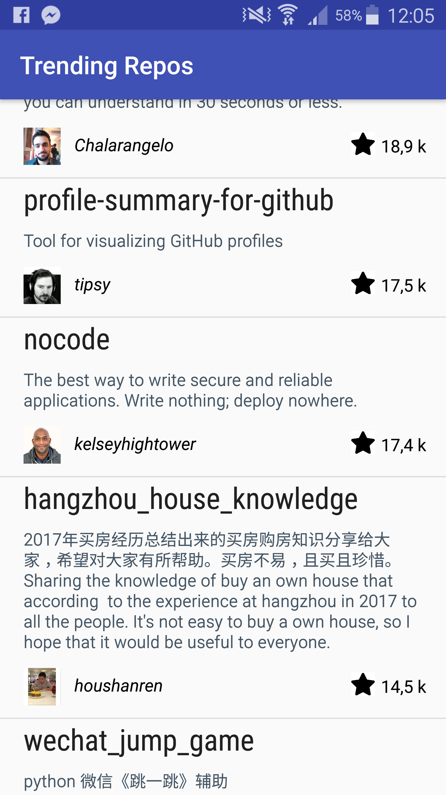

# Trending Repository 

## About
This is a small app that will list the most starred Github repos that were created in the last 30 days. It'll fetch the sorted JSON data directly from the Github API.

##  Requirements
* Android Studio 3.0 or above.
* Android SDK with Android platform version 26 (Android 8.0)

## Getting Started 

1. Clone this repository onto your computer: git clone https://github.com/Abdlfattah/TrendingRepos.git
2. Open Android Studio
3. Either press "Open an Existing Android Studio Project" or click File > Open...
4. Navigate to TrendingRepos. Press Choose, or OK
5. Wait for the Gradle execution to complete. You should see "app" appear as one of the build configurations
6. Run the application (Run > Run 'App'), choose either a connected device or a simulator to run on
7. When the application loads, you will have a list of the most starred Github repos

## The most important Libraries and classes in this projet  

  1. #### Universal Image Loader
     This library provide a good instrument for image loading, caching and displaying. It provides a lot of configuration options and good control over the image loading and caching process.
   
  2. #### Java.net.HttpURLConnection, java.io.BufferedInputStream and BufferedReader
     The popular choices among the Java developers for interacting with web servers and retrieve data.
  
  3. #### org.json.JSONObject and org.json.JSONArray
     In general all the JSON nodes will start with a square bracket or with a curly bracket. The difference between [ and { is, the square bracket ([) represents starting of an JSONArray node whereas curly bracket ({) represents JSONObject. So while accessing these nodes we need to call appropriate method to access the data. If JSON node starts with [, then we should use getJSONArray() method. Same as if the node starts with {, then we should use getJSONObject() method
